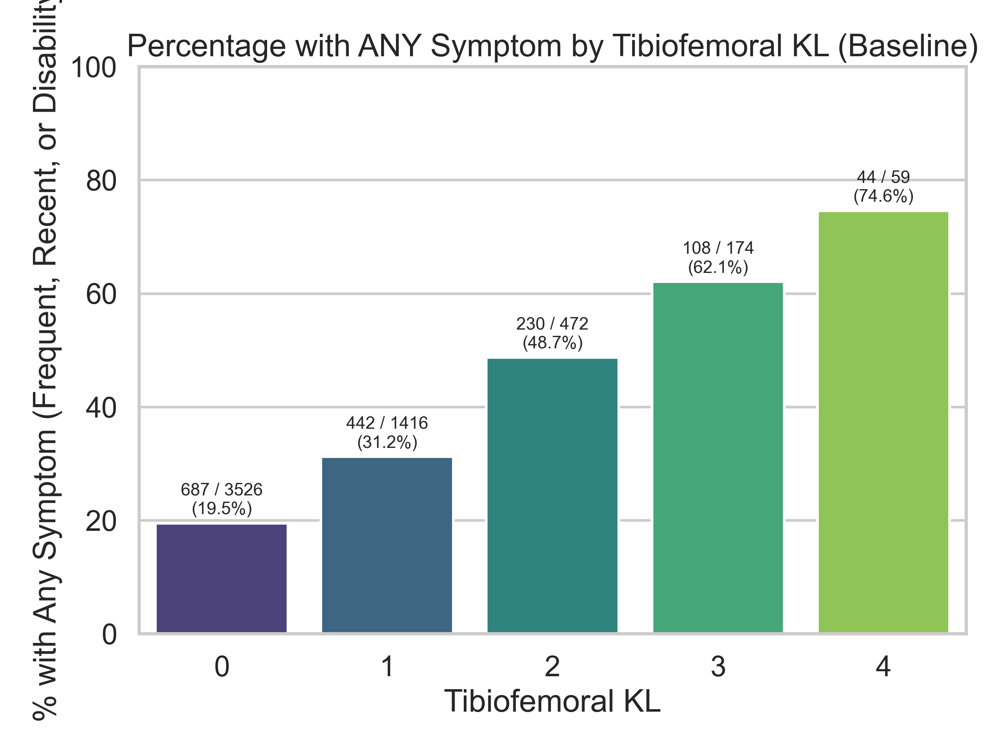
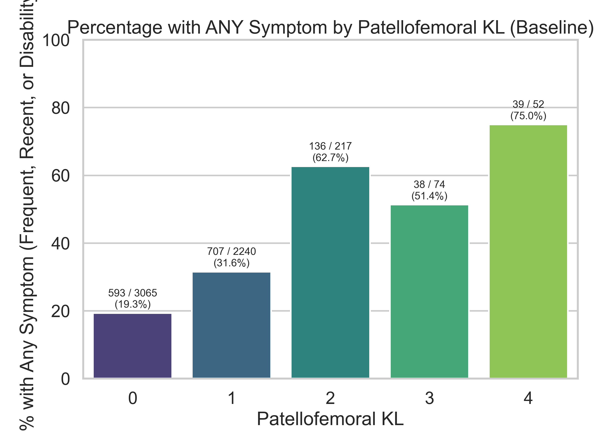
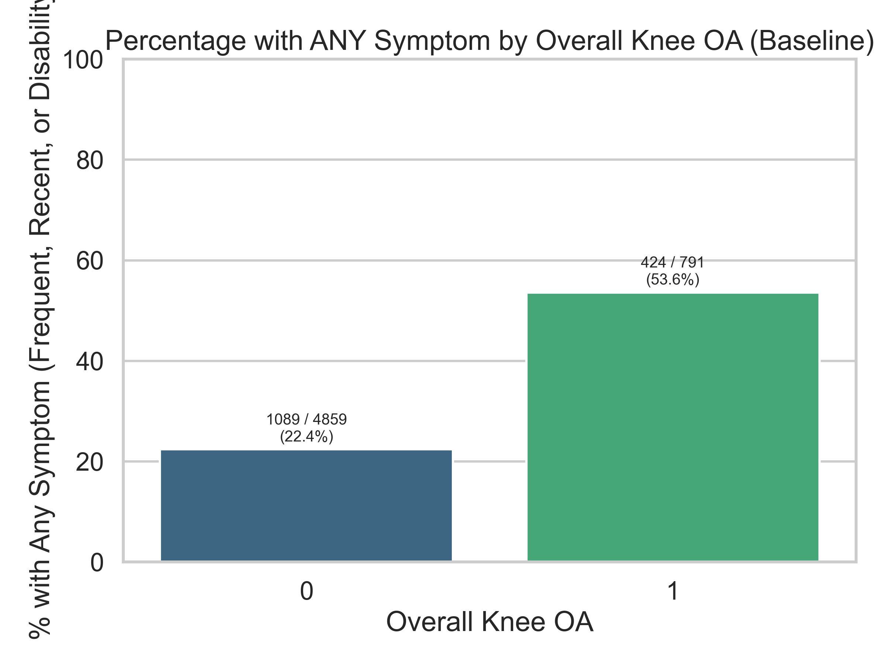
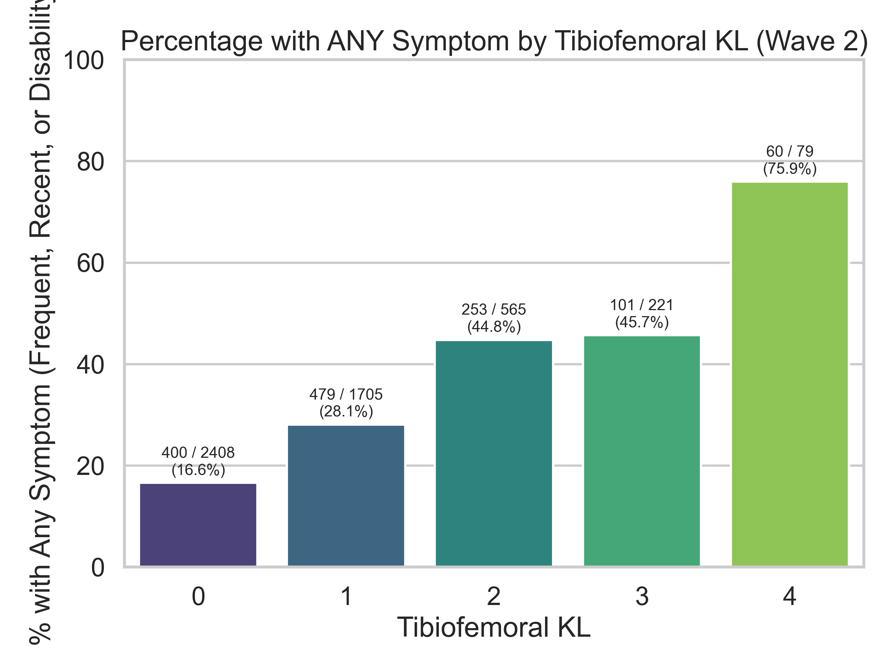
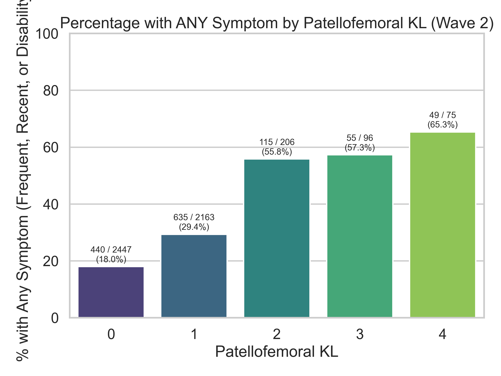
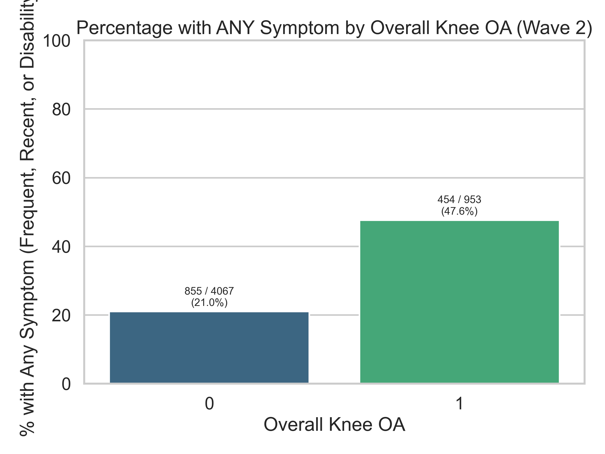

# Any Symptom vs KL / OA Relationships (Portable)

These charts show the percentage of knees that displayed **ANY symptom** (Frequent Symptoms, Recent 7d Pain, or Knee Disability) grouped by their respective KL grade or OA status.

## Tibiofemoral KL (Baseline)

## Patellofemoral KL (Baseline)

## Overall Knee OA (Baseline)

## Tibiofemoral KL (Wave 2)

## Patellofemoral KL (Wave 2)

## Overall Knee OA (Wave 2)

